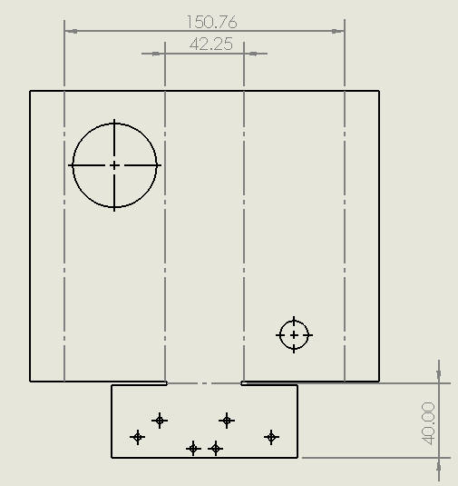

# TurtleBot Mechanical Documentation

This document provides detailed instructions for printing, assembling, and integrating the launcher onto your TurtleBot.

---
## Components
---
### TurtleBot3 Subcomponents
- LiDAR
- RaspberryPi
- OpenCR 1.0
- 2x Dynamixel motors
- LiPo Battery
- USB2LDS

### Bill of Materials
- JF-Z05 Solenoid
- 400 Tie-Point Solderless Breadboard
- Zip ties
- Drain Hose (Inner Diameter: 45mm)
- Ball Caster
- Acrylic Sheet (400mm x 600mm x 2mm)

### Printed Parts
- Solenoid Holder: Holds solenoid in place 
- RPi Camera Holder

### Laser Cut Parts (Acrylic)
- Launcher
- Launcher Stand

### Hardware
- Zip ties
- Drain Hose (Inner Diameter: 45mm)
- Ball Caster
- Hot Glue or any adhevsive
---
## Assembly Instructions
---
### Step 1: Launcher Assembly 

  1.  Using an acrylic bender, bend along the 4 construction lines (perpendicular to the longest axis) shown in the image above at 90 degrees
  2.  Bend the acrylic along notch (40mm from bottom) at 25 degrees
  3.  Glue ball caster to bottom of launcher stand
  4.  Glue launcher stand along barrel of launcher until desired height
  5.  Glue Solenoid and Solenoid Holder in barrel 

### Step 2: Installing Launcher
  1. Bolt launcher onto the 1st Waffle plate using M3 Hex Allan Screws and Nuts
  2. Cut a slit on hose and fit it into 45mm hole on launcher
  3. Secure hose using zip ties on waffle plate

---

## Mechanical and Assembly Recommendations
---
* Ensure that solenoid is aligned properly before securing it with adhesive
* Ensure that there is 7-10mm gap between the ball and launcher before each shot
* Test the launching mechanism a few times to find desired ball & solenoid position 
---
## Design Reasoning 
---
* Used acrylic as it was the cheapest resource availble to our team allowing us to iterate through multiple designs
* Only used a solenoid as it would be a simple launching mechanism for integration and allow for balls to be launched individually
---
## Areas for Improvement 
---
* Design is simple but also incurs greater reliability risk as ball trajectory depends heavily on ball position which is inconsistent and hard to replicate
* Robot overall size is relatively large for maze which is bad for tight corners; need to find ways to shorten launcher and feeding mechanism